# Motion-Tracking

This project uses convolutional neural networks to track an object through sequential video frames.  It is
inspired by [Recent Advances in Offline Object Tracking](http://arxiv.org/pdf/1604.01802v1.pdf). We aimed to recreate and improve on these recent advancements.

Our work process included collecting data from the [ALOV300++](http://www.alov300.org/) and [ILSVRC2014](http://www.image-net.org/challenges/LSVRC/2014/) datasets, augmenting the data through random croppings, and building multiple convolutional neural networks.

## Preliminary Findings

We have encouraging early results. Below are 10 randomly selected pairs of starting and ending frames (e.g. one frame after another). The starting frames on the left have the bounding box originally given as an input (green). The ending frames on the right have the ground truth bounding box (green) and the bounding box predicted by our model (red).

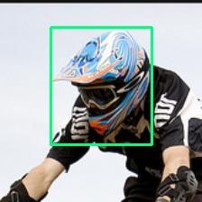
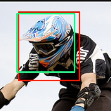

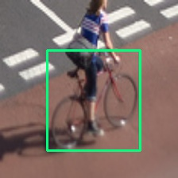
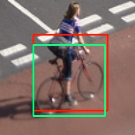

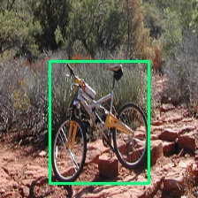
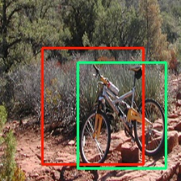

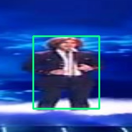
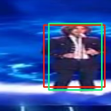

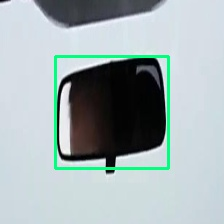
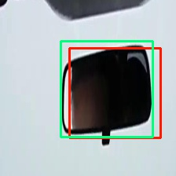

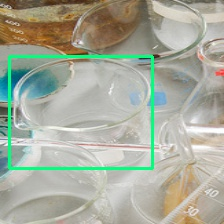
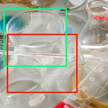

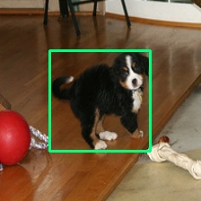
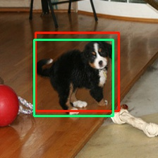

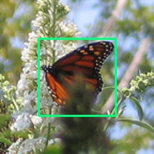
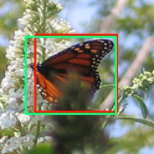

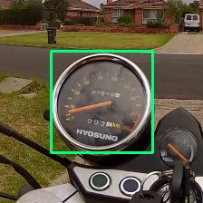
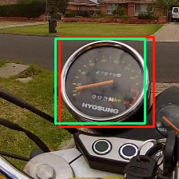

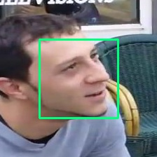
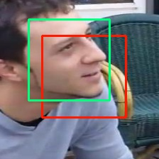

## Error Analysis

In plotting the actual versus predicted coordinates below for a random sample of 500 images, we can get a sense of how our network is learning. At the top-left we have x0, top right y0, bottom-left x1, and bottom-right x1. These correspond to the upper left corner (x0, y0) and bottom right corner (x1, y1) of the bounding. The kernal density estimates below show that we are on average predicting fairly well (as seems to also be indicated by the images above), but still have some variabilty in how well those predictions are lining up to the ground truth. 

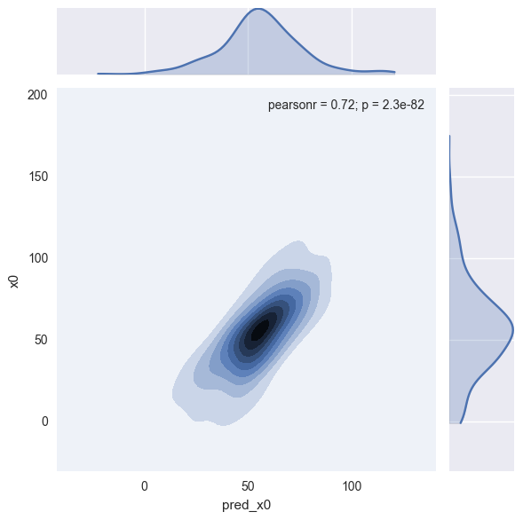
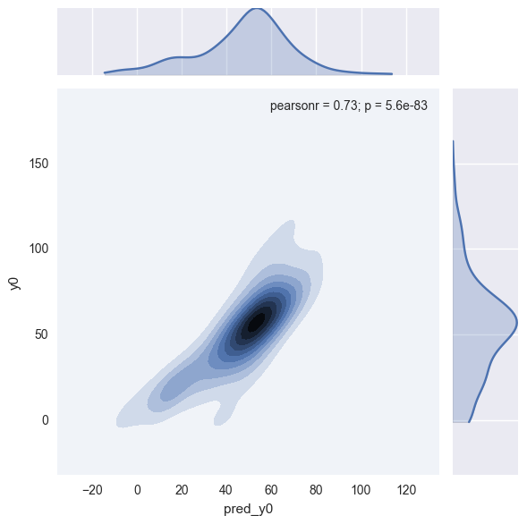

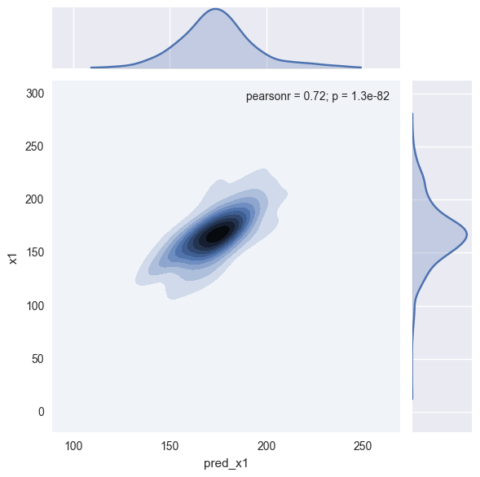
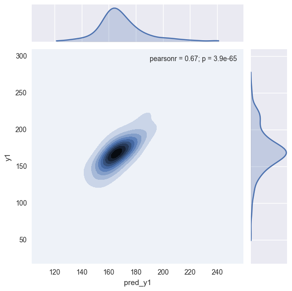

Moving forward, we hope to continue improving the object tracker through alternative architectures and larger networks.
